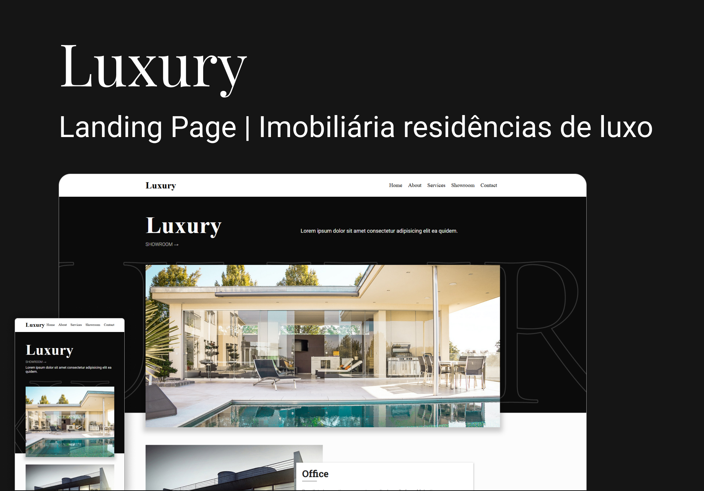

<div align="center">

  # Luxury
  
  <p>Landing Page site institucional de uma imobiliária de residências de luxo</p>
  
   &nbsp;
   &nbsp;
   &nbsp;
   &nbsp;

  
</div>

<div>

  # ⚡ Overview
  <b>Luxury</b>: É uma Landing page para para uma imobiliária fictícia de residências de alto padrão.<br />
  Foquei em manter simplicidade e com conceitos de modernidade arquitetural, uma estrutura sólida e disruptiva.
   
  ## Features:
  - Manipulação de DOM
  - Totalmente Responsivo
  - SEO otimizado
  - W3C validação
  - Animações suaves
  - Animações de entradas com lib AOS JS.
  - Página com carregamento rápido
  - Página Home | Styleguide
  - Layout Clean e Moderno

  # 📚 Aprendizados
  Extrair a paleta de cores da brand da empresa e utiliza no projeto. <br />
  Trabalhar com cliente de alto nível.
  <br /><br />
  
  # 🚀 Deploy
  [Ver online](https://header-01.softwarealles.repl.co/)

  ## Clone

  ```
  git clone git@github.com:DiogoRealles/lp-luxury.git
  ```
</div>


<footer>
  <p>Gostou? deixa seu like!</p>
  <p>Estou disponível para realizar seus projetos</p>
  <a href="mailto:diogorealles@hotmail.com"></a>
  <a href="https://www.linkedin.com/in/diogorealles/"></a>
  
  <p><strong>Diogo Realles | 2024</strong></p>
</footer>
