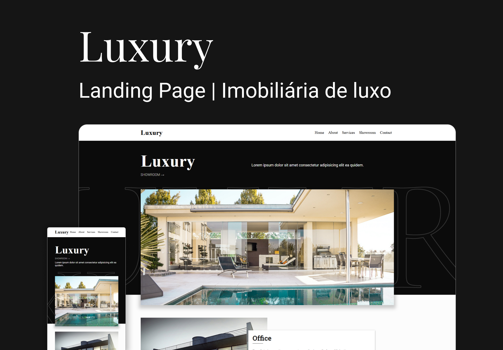

<div align="center">

  # Luxury
  
  <p>Landin Page site institucional de uma imobilizaria de casasresidências de luxo</p>
  
   &nbsp;
   &nbsp;
   &nbsp;
   &nbsp;

  
</div>

<div>

  # Aprendizados
  Extrair a paleta de cores da brand da empresa e utiliza no projeto. <br />
  Trabalhar com cliente de alto nível.
  <br /><br />

  # <b>[Ver online 🡽](https://header-01.softwarealles.repl.co/)</b>

  ## Clone

  ```
  git clone https://github.com/DiogoRealles/lp-luxury
  ```
</div>


<footer>
  <p>Gostou? deixa seu like!</p>
  <p>Estou disponível para realizar seus projetos</p>
  <a href="mailto:diogorealles@hotmail.com"></a>
  <a href="https://www.linkedin.com/in/diogorealles/"></a>
  
  <p><strong>Diogo Realles | 2024</strong></p>
</footer>
